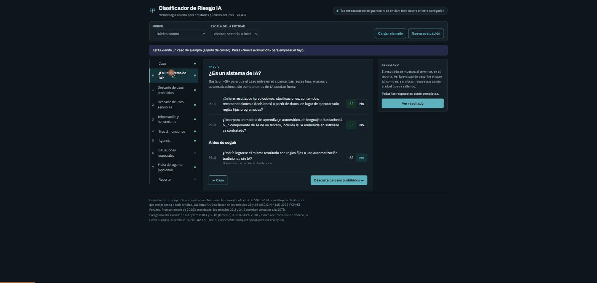

# Clasificador de Riesgo IA

Herramienta web abierta para que las entidades públicas del Perú autoevalúen el riesgo de sus sistemas y proyectos de inteligencia artificial, con base en la Ley N.° 31814 y su Reglamento (D.S. N.° 115-2025-PCM).

**🔗 Usar la herramienta en línea: <https://rriscomba.github.io/clasificador-riesgo-ia/>**



La persona responsable responde un cuestionario guiado de siete pasos. La herramienta entrega dos resultados separados: la **clasificación regulatoria preliminar** del artículo 22 del Reglamento (uso indebido, riesgo alto o riesgo aceptable, con su base legal) y el **nivel interno de gestión** (1 a 4), que es metodología propia. Además indica quién debe aprobar el caso, qué obligaciones de los artículos 25 a 32 corresponden (como lista pendiente de evidencia) y genera un reporte exportable.

> **Aviso.** Es una herramienta de apoyo a la autoevaluación. Su resultado es preliminar: no certifica el cumplimiento del Reglamento ni constituye pronunciamiento o actuación de supervisión de la SGTD. No es una herramienta oficial de la SGTD-PCM ni reemplaza la clasificación que corresponde a cada entidad. Las listas de usos indebidos (art. 23.1) y de riesgo alto (art. 24.1) se basan en el texto del Reglamento publicado en El Peruano el 9 de setiembre de 2025; los criterios adicionales se identifican con los códigos AX, NX y SF. Ante dudas, los artículos 23.3 y 24.2 permiten consultar a la SGTD.

## Privacidad

- **No guarda nada.** Las respuestas viven solo en la memoria del navegador mientras la página está abierta. No se usan cookies, `localStorage`, `sessionStorage`, IndexedDB ni ningún servidor.
- **No envía respuestas.** La herramienta no tiene backend. El reporte se genera en el navegador y solo sale de él si la persona lo copia o lo descarga.
- **Contador opcional y anónimo.** Si se configura, al exportar un reporte se envía una única petición `POST` **sin contenido** a un contador que suma 1. No viaja ningún dato del caso ni de la persona. Viene desactivado por defecto (ver [Contador anónimo](#contador-anónimo)).
- **Dependencias externas.** Solo las fuentes tipográficas de Google Fonts. Si se prefiere evitarlas, basta con borrar las tres líneas `<link>` de `index.html`: la interfaz usa fuentes del sistema como respaldo.

Todo el código es legible y no tiene pasos de compilación, para que cualquier entidad pueda auditarlo.

## Uso

**Publicación oficial:** el artículo 28.8 del Reglamento pide a las entidades públicas publicar el código fuente de sus sistemas de IA financiados con fondos públicos, con licencia libre o abierta, en la Plataforma Nacional de Software Público Peruano (PNSSP). Este repositorio puede registrarse allí y mantenerse en GitHub como espejo.

**En línea:** <https://rriscomba.github.io/clasificador-riesgo-ia/> (GitHub Pages, rama `main` / raíz).

**Local:** descargar el repositorio y abrir `index.html` en el navegador. No requiere instalación ni servidor.

### Pasos de la evaluación

| Paso | Qué se evalúa | Efecto |
|---|---|---|
| 0 | Ámbito jurídico (tipo de organización, art. 3; excepciones, art. 4) y ¿es un sistema de IA? | Una excepción del art. 4 o un «No» a ambas preguntas de IA dejan el caso fuera de alcance |
| 1 | Descarte de usos prohibidos (art. 23.1, literales a a f; criterios adicionales AX) | A1–A6: uso indebido del art. 23. AX: la metodología no admite el caso, pero no es una clasificación jurídica |
| 2 | Descarte de usos sensibles (art. 24.1, literales a a j; criterios adicionales NX y SF) | N1–N9: clasificación regulatoria de riesgo alto. Todos fijan un piso de nivel interno alto |
| 3 | Clasificación de la información × herramienta | Si la combinación no es viable, el caso no avanza hasta cambiarla |
| 4 | Tres dimensiones de la evaluación integrada de impacto: impacto de IA, datos personales y ciberseguridad | Puntaje de 1 a 4 por dimensión |
| 5 | Nivel de agencia y permisos del sistema | Piso por agencia y autonomía máxima permitida |
| 6 | Situaciones especiales (entorno de prueba, herramienta ya aprobada, excepción temporal, desempeño demostrado) | Ajustan el resultado o la ruta de aprobación |
| 7 | Ficha del agente (solo si el sistema ejecuta acciones con aprobación previa o por su cuenta, o puede escribir o actuar en otros sistemas) | No cambia la clasificación: registra misión, límites, conexiones, acciones permitidas, que requieren aprobación y prohibidas, controles, pruebas, monitoreo, supervisor y fecha de reautorización |

### Ayudas y diseño para respuestas honestas

Al pasar el cursor (o enfocar con el teclado) sobre cualquier opción o campo aparece una ayuda en lenguaje sencillo, con ejemplos generales. En pantallas táctiles la ayuda aparece unos segundos después de tocar la opción. Los textos están en `js/ayudas.js` y pueden editarse sin tocar la lógica.

El paso 0 incluye una pregunta orientativa: si una automatización tradicional bastaría, la herramienta lo anota en el reporte como alternativa a evaluar.


El resultado solo se muestra al terminar, en el reporte, para que nadie ajuste sus respuestas según el nivel que va saliendo. Las listas de los pasos 1 y 2 se responden con «No aplica / Aplica», con colores neutros. El resultado explica la ruta que sigue el caso (vía rápida, revisión del Oficial de IA o acompañamiento reforzado) en lugar de presentarlo como una sanción.

### Clasificación de la información

La herramienta no depende de la clasificación interna de ninguna entidad. Usa una escala común de cuatro niveles basada en el TUO de la Ley N.° 27806 (D.S. N.° 021-2019-JUS) y en la Ley N.° 29733:

| Nivel | Definición | Base |
|---|---|---|
| Pública | Información ya divulgada o de acceso público | Ley N.° 27806, regla general |
| Interna | Pública por ley pero no divulgada: borradores, procedimientos, documentos de trabajo sin datos protegidos | Categoría operativa |
| Confidencial | Excepciones de información confidencial e información de terceros | TUO Ley N.° 27806, art. 17; Ley N.° 29733 |
| Restringida | Información secreta o reservada, datos sensibles, secreto bancario o tributario, credenciales | TUO Ley N.° 27806, arts. 15 a 17; Ley N.° 29733 |

El secreto bancario y el tributario, que la ley trata como confidenciales, se ubican en el nivel restringido por el impacto de su exposición. Si la entidad usa otras etiquetas, puede escribir el nombre de su categoría equivalente; solo aparece en el reporte. Ante la duda, se elige el nivel más alto.

### Clasificación regulatoria y nivel interno

El Reglamento (art. 22) tiene tres categorías jurídicas; la escala de 1 a 4 es metodología propia. La herramienta las muestra por separado:

| Resultado | Qué lo determina | Qué no lo cambia |
|---|---|---|
| **Clasificación regulatoria preliminar**: uso indebido (arts. 22.1 a y 23.1), riesgo alto (arts. 22.1 b y 24.1) o riesgo aceptable (art. 22.2), con el literal aplicable | Ámbito (arts. 3 y 4), A1–A6 y N1–N9 | Medidas de reducción, sandbox, criterios adicionales AX, NX y SF |
| **Nivel interno de gestión**: 1 bajo, 2 moderado, 3 alto, 4 crítico | Dimensiones, agencia, Listas A y B completas | — |

Así, un caso puede tener nivel interno alto (por ejemplo, por un criterio sectorial SF) y ser jurídicamente de riesgo aceptable; el reporte lo aclara. Si el caso es de riesgo alto, la evaluación de impacto del art. 30 figura como requerida (art. 32, voluntaria, para el sector privado).

Un uso del art. 24.1 solo deja de aplicar si el **caso de uso se rediseña** (S3): el reporte lo registra como «rediseño declarado» y pide verificarlo documentalmente. Los controles bajan el riesgo residual, pero no cambian la clasificación regulatoria.

### Reglas de cálculo del nivel interno

- Cada dimensión toma el mayor valor entre: el promedio de sus factores redondeado (0,5 hacia arriba); 3, si un factor crítico vale 4; y 2, si cualquier factor vale 4.
- Nivel = máximo entre las tres dimensiones, el piso de la Lista B y el piso por agencia. 1 = bajo, 2 = moderado, 3 = alto, 4 = crítico.
- Las medidas de reducción (rutas R1 a R9) solo bajan los factores sobre los que actúan y nunca por encima del puntaje inherente; R6 y R7 bajan como máximo un nivel. Los usos indebidos no admiten reducción, y los disparadores de riesgo alto solo dejan de aplicar con un rediseño del caso de uso aprobado y verificable (S3).
- El entorno experimental (S1) usa un plazo máximo de 90 días como **criterio interno** configurable (`SANDBOX_DIAS_MAX` en `js/metodologia.js`); el art. 17 del Reglamento no fija un plazo.

### Reporte

Incluye la clasificación regulatoria con su base legal, el nivel interno, y una lista de obligaciones aplicables (arts. 25, 29 y 30 para entidades públicas; 25, 31 y 32 para el sector privado) marcadas como pendientes de evidencia: la herramienta no verifica su cumplimiento.


- **Copiar**: texto en Markdown, listo para pegar en un documento o correo.
- **Descargar HTML**: reporte autocontenido, imprimible como PDF.
- **Descargar JSON**: datos estructurados, útiles para alimentar el inventario de IA de la entidad.

Las decisiones tomadas ante la auditoría del 27 de setiembre de 2026 están en [docs/respuesta-auditoria.md](docs/respuesta-auditoria.md).

## Estructura

```
index.html            Página de la aplicación
css/estilos.css       Estilos (tema claro y oscuro)
js/metodologia.js     Contenido de la metodología: listas, factores, escalas, rutas, perfiles y ficha del agente
js/ayudas.js          Textos de las ayudas flotantes
js/motor.js           Lógica de clasificación (funciones puras, sin estado ni red)
js/app.js             Interfaz y generación del reporte
js/config.js          Configuración de despliegue (dirección del contador)
pruebas/              Pruebas del motor
contador/             Contador anónimo opcional (Cloudflare Worker)
```

## Adaptar la metodología

Todo el contenido normativo está en `js/metodologia.js`, separado de la lógica:

- **Perfiles sectoriales**: el núcleo común aplica a cualquier entidad; el perfil *sistema financiero* agrega disparadores y normas de la SBS. Para crear un perfil (salud, educación, programas sociales, tributación, etc.), añada una entrada en `perfiles` con su lista de disparadores y agregue esos disparadores en `listaB`.
- **Escalas de entidad**: los umbrales de número de titulares de datos cambian según `escalas` (alcance sectorial o nacional masivo).
- **Aprobadores y tratamiento**: se ajustan en `tratamiento` según la estructura de gobierno de la entidad.

Después de cualquier cambio, ejecute las pruebas.

## Pruebas

Requiere Node.js 18 o superior:

```
node pruebas/motor.test.js
```

Las pruebas verifican doce casos de referencia del nivel interno (uso de productividad, modelos de evaluación, agentes autónomos, información restringida en herramientas públicas, sandbox, entre otros) y nueve de la clasificación regulatoria (base legal, medidas que no la cambian, rediseño por verificar, criterios adicionales, excepciones del art. 4).

## Contador anónimo

Es opcional y permite saber cuántos reportes se han generado, sin ningún otro dato.

1. Cree una cuenta en Cloudflare e instale Wrangler (`npm install -g wrangler`).
2. Cree el espacio de almacenamiento: `wrangler kv namespace create CONTADOR` y copie su `id` en `contador/wrangler.toml`.
3. En `wrangler.toml`, reemplace `ORIGEN_PERMITIDO` por la dirección donde se publica la herramienta.
4. Despliegue desde la carpeta `contador/`: `wrangler deploy`.
5. Copie la dirección del worker en `js/config.js` (`contadorUrl`).

`GET` a esa dirección devuelve `{"reportes": N}`. El worker no lee el cuerpo de la petición ni registra datos de origen. Tenga en cuenta que Cloudflare puede mantener registros técnicos propios de su plataforma.

## Fundamentos

La metodología se apoya en:

- Ley N.° 31814 y su Reglamento, [D.S. N.° 115-2025-PCM](https://busquedas.elperuano.pe/dispositivo/NL/2436426-1): artículos 22 a 24 (clasificación de riesgos), 28 (obligaciones de las entidades públicas, incluida la publicación del código en la PNSSP), 29 (medidas de seguridad digital) y 30 (evaluación de impacto de riesgo alto).
- Estrategia Nacional de Inteligencia Artificial 2026-2030 (R.M. N.° 152-2026-PCM).
- Ley N.° 29733 y su Reglamento (D.S. N.° 016-2024-JUS); D.L. N.° 1412; D.U. N.° 007-2020.
- Estándares del art. 33 del Reglamento: NTP-ISO/IEC 27002:2022, ISO/IEC 38507:2022, NTP-ISO/IEC 42001:2025, ISO/IEC 23053:2022 y NTP-ISO/IEC 27005:2022.
- [Algorithmic Impact Assessment](https://www.canada.ca/en/government/system/digital-government/digital-government-innovations/responsible-use-ai/algorithmic-impact-assessment.html) (Gobierno de Canadá): cuestionario con niveles de impacto y medidas de mitigación.
- [EU AI Act, artículo 6](https://ai-act-service-desk.ec.europa.eu/en/ai-act/article-6): clasificación de riesgo alto y excepción por tareas acotadas.
- [AI impact assessment tool](https://www.digital.gov.au/ai/impact-assessment-tool/introduction) (Gobierno de Australia): evaluación de umbral seguida de evaluación completa.
- [ISO/IEC 42005:2025](https://www.iso.org/standard/42005): evaluación de impacto de sistemas de IA.
- [Levels of Autonomy for AI Agents](https://arxiv.org/abs/2506.12469) (Feng, McDonald y Zhang, 2025): la autonomía como decisión de diseño.

Los parámetros numéricos (umbrales, reglas de redondeo, pisos) son iniciales y deben calibrarse con casos reales.

## Contribuir

Las propuestas son bienvenidas mediante *issues* o *pull requests*, en especial:

- Nuevos perfiles sectoriales.
- Ajustes a las listas A y B ante modificaciones del Reglamento o nuevos lineamientos de la SGTD (por ejemplo, las normas complementarias de evaluación de impacto del artículo 30.3).
- Casos de prueba y resultados de calibración.

Toda propuesta que cambie la lógica de clasificación debe incluir casos de prueba.

## Licencia

[MIT](LICENSE).
